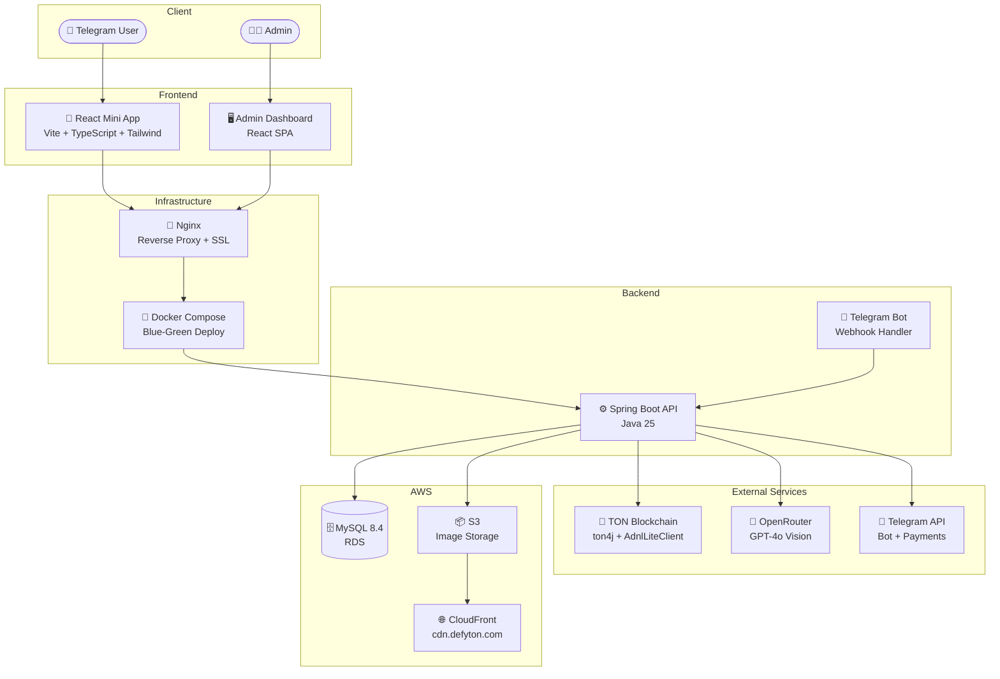

<div align="center">

# 🎯 DefyTON

**AI-powered habit challenge platform on Telegram**

Stake TON, complete daily missions verified by AI, earn rewards.

[](https://openjdk.org/)
[](https://spring.io/projects/spring-boot)
[](https://react.dev/)
[](https://ton.org/)
[](https://core.telegram.org/bots/webapps)
[](https://aws.amazon.com/)

[🌐 Live Service](https://defyton.com) · [📖 Documentation](https://shin-gs.github.io/tg-miniapp-challenge-docs/)

</div>

---

> **📌 Note:** This repository is auto-generated via GitHub Actions from a private source repository. It contains only design specifications and QA test checklists for external viewing. No source code, secrets, or business logic is included here.

---

## 👤 About

Solo full-stack development — Frontend, Backend, Blockchain integration, Infrastructure, and AI — all designed and implemented by a single developer.

## 🛠 Tech Stack

| Layer | Technologies |
|:------|:-------------|
| **Frontend** |      |
| **Backend** |     |
| **Database** |    |
| **Blockchain** |    |
| **AI** |  |
| **Infra** |      |

## 🏗 Architecture



## ☁️ Infrastructure

| Component | Details |
|:----------|:--------|
| **Compute** | AWS EC2 (t3.medium) — Blue-Green deployment (blue:8081 / green:8082) |
| **Database** | AWS RDS MySQL 8.4 LTS — automated backups, LTS support until 2032 |
| **Storage** | AWS S3 — verification photos, profile images |
| **CDN** | CloudFront — custom domain `cdn.defyton.com`, image optimization |
| **Proxy** | Nginx — reverse proxy, SSL termination, upstream hot-swap |
| **Container** | Docker Compose — single JAR packaging (FE + BE bundled) |
| **SSL** | Let's Encrypt — automated certificate renewal |
| **CI/CD** | GitHub Actions — SSH/SCP deploy, zero-downtime switching |
| **Logging** | 3-tier log separation (app / error / financial) + S3 cron backup |

## 🔑 Key Features

- 💎 **Dual payment system** — TON Connect (blockchain direct, 10% fee) + Telegram Stars (no wallet needed)
- ⛓️ **Blockchain integration** — Deposit verification via AdnlLiteClient, seqno-based double-spend prevention
- 🧠 **AI-powered verification** — GPT-4o Vision judges photos, graceful fallback on parse failure
- 🔐 **Security** — Admin OTP 2FA, JWT, HMAC-SHA256 initData validation, XOR+Base62 ID obfuscation
- 📊 **Financial integrity** — balance_before/after audit trail, idempotency keys, synchronized transfers
- 🚀 **Zero-downtime deploy** — Blue-Green with health check polling + nginx upstream hot-swap

## 🤖 Development Process

```
📋 Planning ──→ 🎨 Design ──→ 💻 Implementation ──→ 🔍 Review ──→ ✅ QA
     │               │                │                   │            │
 product-planner  ui-designer   frontend-developer  code-reviewer  qa-tester
                               backend-developer   java-architect
```

- **AI agent-driven pipeline** — Specialized agents for each role, orchestrated by a main agent
- **Document-driven development** — `.cases.md` → HTML/CSS design specs → code → QA checklists
- **Steering documents** — Agent behavior rules, coding standards, and conventions as always-on context
- **Single source of truth** — Business logic document drives all implementation decisions
- **GitHub Pages** — Design specs and QA checklists auto-deployed for external access

## 📖 Documentation

<div align="center">

📎 **[View Design Docs & QA Checklists →](https://shin-gs.github.io/tg-miniapp-challenge-docs/)**

</div>

- 🎨 **Design Specs** — All screens as interactive HTML/CSS (viewable in browser, no build required)
- ✅ **QA Checklists** — Pass/Fail/Skip tracking per test case (localStorage persistence, URL hash routing)

## 🔗 Links

| | URL |
|:--|:----|
| 🌐 Service | https://defyton.com |
| 📖 Docs | https://shin-gs.github.io/tg-miniapp-challenge-docs/ |

## 🔒 Security

All secrets and configuration values (API keys, database credentials, wallet mnemonics, JWT secrets) are managed exclusively via `.env` files and never committed to version control. Environment-specific settings are injected at runtime through Docker environment variables.
