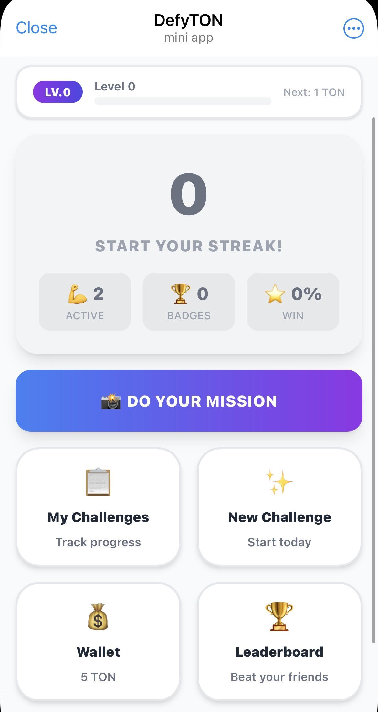
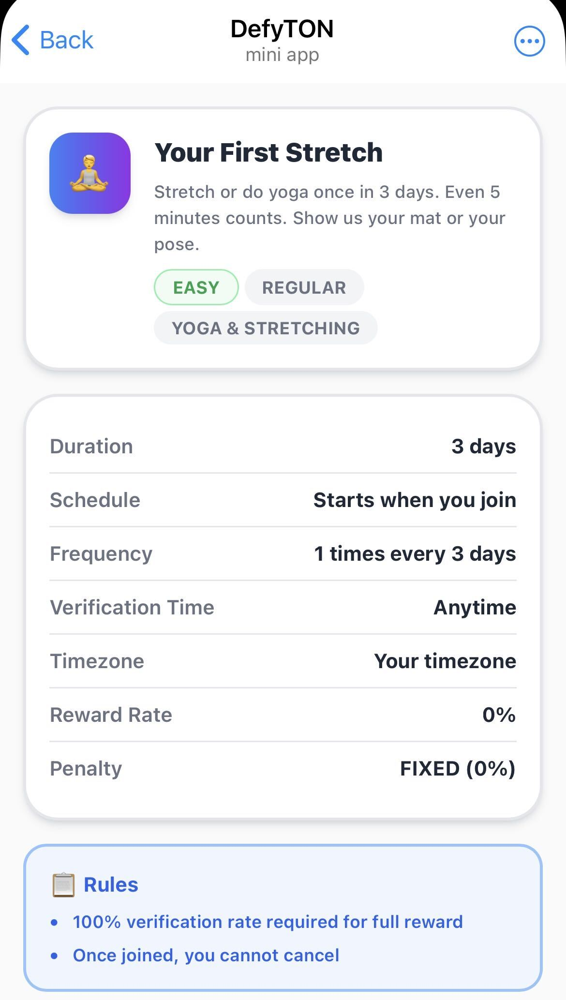
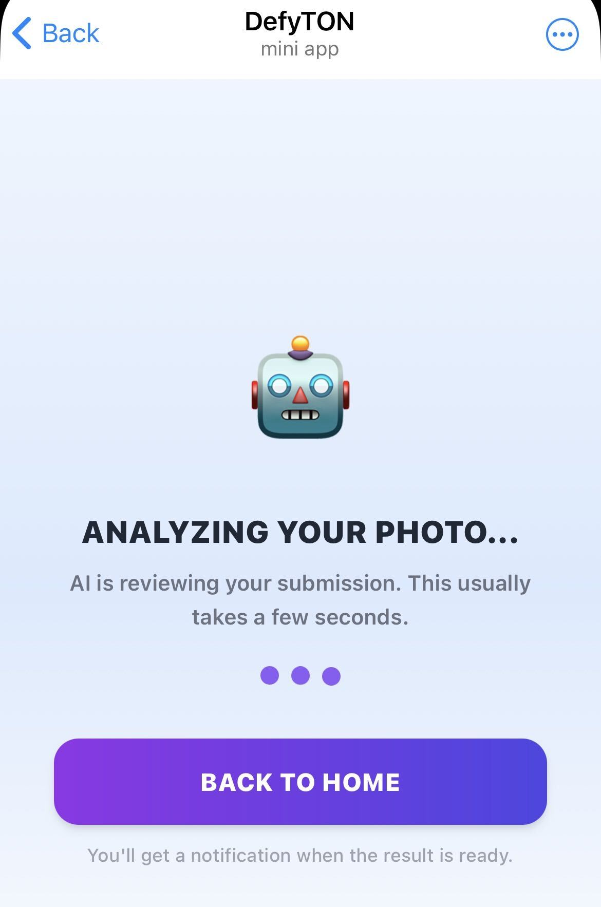
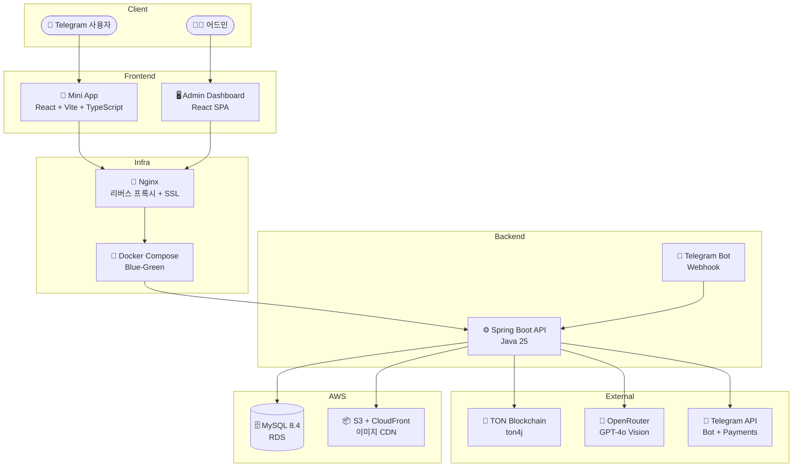

<div align="center">

# 🎯 DefyTON

**AI 기반 보증금 습관 챌린지 플랫폼 — Telegram Mini App**

TON을 예치하고, 사진으로 인증하고, AI가 판정합니다.  
성공하면 보증금 + 리워드 환급, 실패하면 패널티 차감.

[](https://openjdk.org/)
[](https://spring.io/projects/spring-boot)
[](https://react.dev/)
[](https://ton.org/)
[](https://core.telegram.org/bots/webapps)
[](https://aws.amazon.com/)


[🌐 서비스 바로가기](https://defyton.com) · [📖 문서 보기](https://shin-gs.github.io/tg-miniapp-challenge-docs/)

</div>

---

## 📱 스크린샷

<div align="center">
<table>
<tr>
<td align="center"><br/><b>홈</b></td>
<td align="center"><br/><b>챌린지 상세</b></td>
<td align="center"><br/><b>AI 인증</b></td>
</tr>
</table>
</div>

---

## 👤 소개

기획, 디자인, 프론트엔드, 백엔드, 블록체인 연동, 인프라, AI 연동까지  
**1인 풀스택 개발**로 설계하고 구현한 프로젝트입니다.

---

## 🔑 주요 기능

| 기능 | 설명 |
|:-----|:-----|
| 💎 **이중 결제 시스템** | TON Connect(블록체인 직접 전송) + Telegram Stars(지갑 없이 카드 결제) |
| 🧠 **AI 사진 인증** | GPT-4o Vision이 인증 사진을 자동 판정, 파싱 실패 시 안전 fallback |
| ⛓️ **블록체인 연동** | 입금 검증(Toncenter REST) + 출금 전송(AdnlLiteClient), seqno 기반 이중 전송 방지 |
| 📊 **금융 무결성** | balance_before/after 이중 기록, 멱등성 키, synchronized 전송 |
| 🔐 **보안** | OTP 2FA, JWT 인증, HMAC-SHA256 서명 검증, ID 난독화 |
| 🚀 **무중단 배포** | Blue-Green 배포 + Health check + Nginx upstream 전환 |
| 📈 **운영 자동화** | 성장지표 리포트 자동 발송, 정산 대기 알림, Financial 로그 S3 백업 |
| 🤖 **AI 에이전트 개발** | 기획→디자인→구현→리뷰→QA 전 과정을 AI 에이전트 파이프라인으로 수행 |

---

## 🛠 기술 스택

| 레이어 | 기술 |
|:-------|:-----|
| **Frontend** | React 19, Vite 6, TypeScript 5.8, Tailwind CSS 4, TWA SDK, TanStack Query, Zustand |
| **Backend** | Java 25, Spring Boot 4.0, Spring Data JPA, Thymeleaf (SSR), Gradle Kotlin DSL |
| **Database** | MySQL 8.4 LTS (AWS RDS), S3 + CloudFront (이미지 CDN) |
| **Blockchain** | TON (ton4j 2.0.3) — AdnlLiteClient + Toncenter REST 하이브리드 |
| **AI** | OpenRouter API (GPT-4o Vision) |
| **Infra** | AWS EC2, Docker Compose, Nginx, Let's Encrypt, GitHub Actions CI/CD |

---

## 🏗 아키텍처



---

## ☁️ 인프라 & 배포

| 구성 | 상세 |
|:-----|:-----|
| **컴퓨트** | AWS EC2 — Blue-Green 무중단 배포 |
| **데이터베이스** | AWS RDS MySQL 8.4 LTS — 자동 백업, 2032년까지 LTS 지원 |
| **스토리지** | AWS S3 — 인증 사진, 프로필 이미지 |
| **CDN** | CloudFront — 커스텀 도메인, 이미지 최적화 |
| **프록시** | Nginx — 리버스 프록시, SSL 종료, upstream 전환 |
| **컨테이너** | Docker Compose — FE + BE 단일 JAR 패키징 |
| **SSL** | Let's Encrypt — 자동 갱신 (cron) |
| **CI/CD** | GitHub Actions — 빌드 → SCP 전송 → Blue-Green 전환 |
| **모니터링** | 3단계 로그 분리 (app/error/financial) + Telegram 에러 알림 + 성장지표 리포트 |
| **백업** | RDS 자동 스냅샷 + Financial 로그 S3 일일 백업 |

### 비용 최적화
- EC2 Savings Plan + RDS Reserved Instance (연간 선결제 ~35% 절감)
- CloudFront Free 플랜 (1TB/월 무료 전송)
- Cloudflare DNS (Route53 대비 $0.50/월 절약)
- 단일 서버 + Docker Compose (오버엔지니어링 없는 적정 아키텍처)

---

## 📁 프로젝트 구조

```
tg-miniapp-challenge/
├── packages/
│   ├── miniapp/          # React Telegram Mini App (사용자)
│   ├── admin/            # React Admin Dashboard (어드민)
│   └── backend/          # Spring Boot API 서버
├── docker/               # Docker Compose + Nginx + 배포 스크립트
├── docs/                 # 디자인 명세 + QA 체크리스트
└── .github/workflows/    # CI/CD 파이프라인
```

- **모노레포** (pnpm workspace) — FE/BE 빌드 통합 관리
- **단일 JAR 패키징** — FE 빌드 결과물을 BE static 리소스로 번들링
- **레이어드 아키텍처** — Controller → Service → Infra → Client

---

## 🤖 개발 프로세스

```
📋 기획 ──→ 🎨 디자인 ──→ 💻 구현 ──→ 🔍 리뷰 ──→ ✅ QA
```

AI 에이전트 파이프라인으로 각 단계를 수행:
- **문서 기반 개발** — `.cases.md`(케이스 정의) → HTML 디자인 명세 → 코드 → QA 체크리스트
- **단일 소스 진실** — 비즈니스 로직 문서가 모든 구현의 기준
- **자동 배포** — 디자인 명세와 QA 체크리스트를 GitHub Pages로 자동 공개

---

## 📖 문서

| 문서 | 설명 |
|:-----|:-----|
| [🎨 디자인 명세](https://shin-gs.github.io/tg-miniapp-challenge-docs/design/) | 모든 화면의 인터랙티브 HTML/CSS 명세 |
| [✅ QA 체크리스트](https://shin-gs.github.io/tg-miniapp-challenge-docs/test/) | 기능별 수동 테스트 (Pass/Fail/Skip 추적) |

---

## 🔒 보안

- 모든 시크릿(API 키, DB 비밀번호, 지갑 니모닉 등)은 `.env` 파일로 관리, 버전 관리 미포함
- 환경별 설정은 Docker 환경변수로 런타임 주입
- 운영 설정(환율, 비용 등)은 DB 테이블에서 관리 (서버 재시작 불필요)
